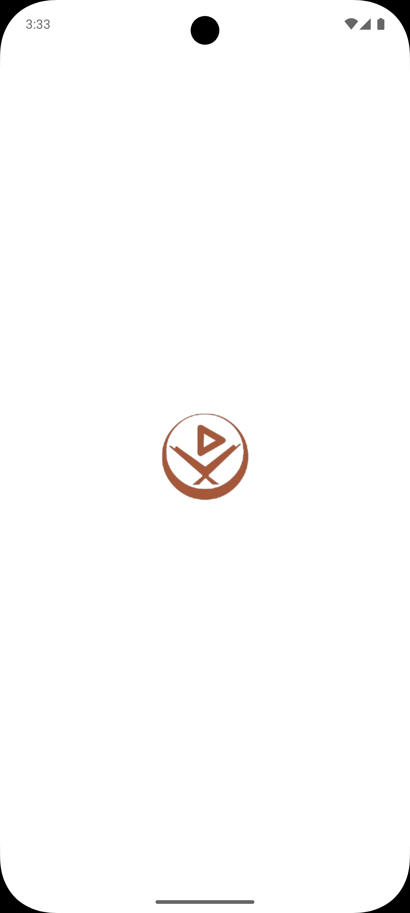

# Quran App

[](https://flutter.dev/)
[](https://dart.dev/)
[](./LICENSE)

## 📖 Overview

**Quran App** is a modern, cross-platform application designed to provide users with a beautiful and seamless experience for reading, searching, and interacting with the Holy Quran. Built using Flutter and Dart for speed and flexibility.

## ✨ Features

- **Read the Quran:** Browse all Surahs (chapters) and Ayahs (verses) with clear Arabic text.
- **Audio Playback:** Listen to recitations by popular Qaris, with playback controls.
- **Offline Access:** Read and search the Quran without an internet connection.
- **Custom Designed Sound Player:** Fully Designed Sound Player from scratch
- **All Types of Azkar:** Access a comprehensive collection of daily Azkar (remembrances).
- **All Types of Doaa:** Find a variety of authentic Duas (supplications) for different occasions.
- **Electronic Sebha:** Use a digital Tasbih (Sebha) for counting Dhikr and Tasbeeh.

## Screenshots

 &nbsp;&nbsp;&nbsp;  &nbsp;&nbsp;&nbsp;  &nbsp;&nbsp;&nbsp;  &nbsp;&nbsp;&nbsp;  &nbsp;&nbsp;&nbsp;  &nbsp;&nbsp;&nbsp;  &nbsp;&nbsp;&nbsp;  &nbsp;&nbsp;&nbsp; &nbsp;&nbsp;&nbsp; 

## 🚀 Getting Started

### Prerequisites

- [Flutter SDK](https://docs.flutter.dev/get-started/install)
- [Dart SDK](https://dart.dev/get-dart)
- A recent version of Android Studio, VS Code, or Xcode

### Installation

1. **Clone the repository:**
   ```bash
   git clone https://github.com/AhmedAbdElrahman117/Quran-App.git
   cd Quran-App

